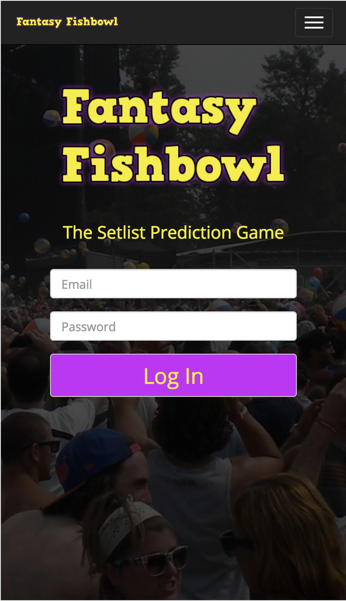
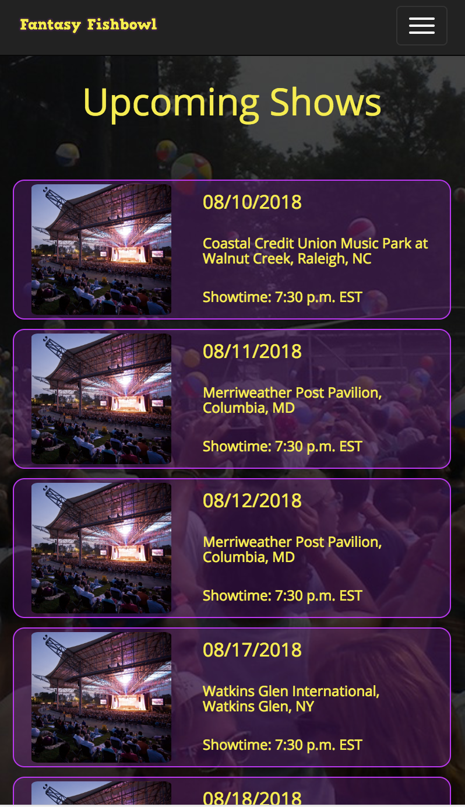
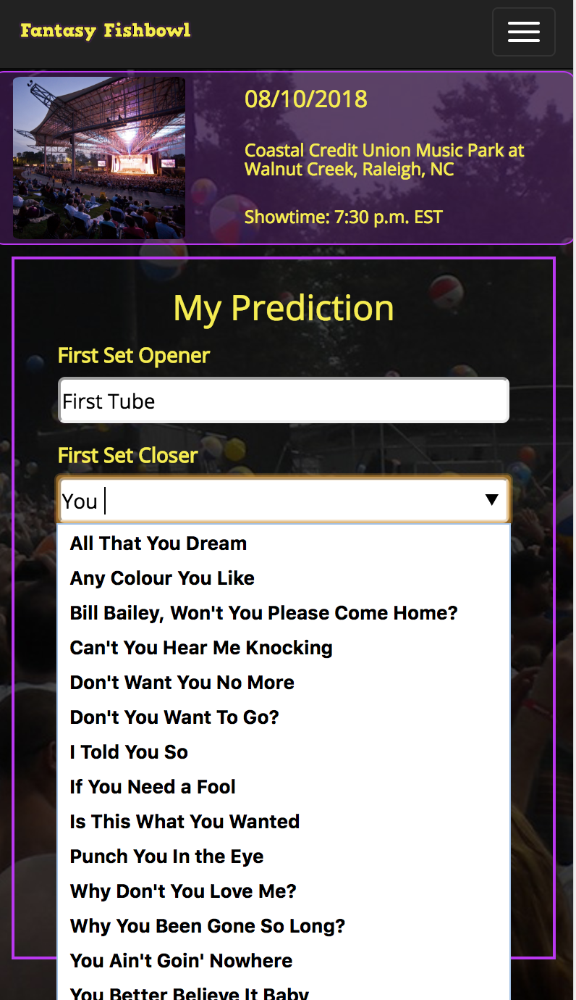

# Fantasy Fishbowl

## Overview

Fantasy Fishbowl is a work in progress fantasy sports-style app for competing with your friends to try and guess what the rock band Phish will play at any given concert.

## Current Engineering Features

* A serialized Rails 5 API backend with a React.js front end
* A JSON Web Token-based authentication workflow utilizing the [jwt](https://rubygems.org/gems/jwt/versions/1.5.4) gem
* An RSpec testing suite
* An autocomplete interface for searching songs built in React

## Screenshots

