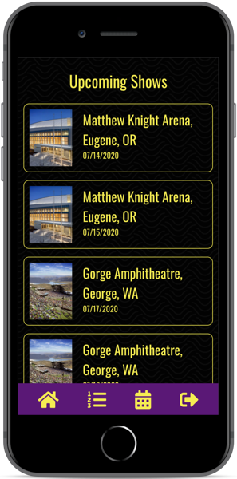
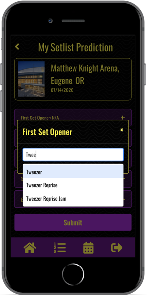

# Fantasy Fishbowl

## Overview

Fantasy Fishbowl is a work in progress fantasy sports-style app designed for mobile; instead of predicting sports performance, players attempt to predict which songs Vermont rock band Phish will play in concert.

This repo comprises the Rails 5 API backend for the app; you can view the TypeScript/React.js front end repo [here](https://github.com/NB28VT/fantasy-fishbowl-typescript-client).

Fantasy Fishbowl is an ongoing personal project built by [Nathan Burgess](https://nb28vt.github.io/).

## Current Technical Features/Toolchain

* Ruby on Rails 5 [JSON API](https://guides.rubyonrails.org/api_app.html)
* Rails [ActiveModelSerializers](https://www.rubydoc.info/gems/active_model_serializers) for JSON serialization
* [JSON Web Token](https://jwt.io/introduction/) authentication
* Test suite built with [RSpec](https://rspec.info/)
* Image asset storage with Rails [ActiveStorage](https://edgeguides.rubyonrails.org/active_storage_overview.html)
* API client for obtaining concert info from the [Phish.net fan API](https://phishnet.api-docs.io/v3/the-phish-net-api/welcome)
* Custom [Nokogiri](https://nokogiri.org/) parser for serializing Phish.net API data that is returned as HTML instead of JSON

  
  

